<div align="center">

# A3Mailer 📧

**AI-Powered Web3-Native Mail Server**

*Next-generation mail server integrating Artificial Intelligence & Web3 blockchain technology*

[](https://github.com/a3mailer/a3mailer/actions/workflows/ci.yml)
[](https://www.gnu.org/licenses/agpl-3.0)
[](https://github.com/a3mailer/a3mailer/releases)
[](https://github.com/a3mailer/a3mailer)

[](https://a3mailer.com/docs)
[](https://discord.gg/a3mailer)
[](https://www.reddit.com/r/a3mailer/)

---

**🤖 AI-Powered** • **⛓️ Web3-Native** • **🚀 Production-Ready** • **⚡ High-Performance** • **🔒 Security-First**

[📥 Quick Start](#-quick-start) • [📖 Documentation](https://a3mailer.com/docs) • [💬 Community](#-community) • [🤝 Contributing](#-contributing)

</div>

## 📋 Table of Contents

- [✨ Features](#-features)
- [🚀 Quick Start](#-quick-start)
- [📦 Installation](#-installation)
- [🔧 Configuration](#-configuration)
- [📊 Performance](#-performance)
- [🏗️ Architecture](#️-architecture)
- [🤝 Contributing](#-contributing)
- [💬 Community](#-community)
- [📄 License](#-license)
- [🙏 Acknowledgments](#-acknowledgments)

## ✨ Features

**A3Mailer** is a revolutionary mail and collaboration server that combines the power of **Artificial Intelligence (AI)** and **Web3 blockchain technology** with Rust's performance and security. The "A3" represents our commitment to integrating the latest AI and Web3 innovations into email infrastructure.

### 🔤 What does "A3" mean?
- **A** = **Artificial Intelligence** - Smart threat detection, automated content analysis, and intelligent routing
- **3** = **Web3** - Blockchain integration, decentralized identity, and cryptographic security
- **Together** = **A3** - The fusion of AI and Web3 technologies for next-generation email

### 🎯 **Why Choose A3Mailer?**

#### 🤖 **AI-Powered Intelligence**
- **Smart Threat Detection**: ML-driven anomaly detection and behavioral analysis
- **Intelligent Content Analysis**: AI-powered spam filtering and content classification
- **Automated Security**: Real-time threat response and adaptive security measures
- **Predictive Analytics**: AI-driven insights for email patterns and user behavior

#### ⛓️ **Web3 & Blockchain Integration**
- **Decentralized Identity**: Web3-native authentication and identity management
- **Cryptographic Security**: Blockchain-based message integrity and verification
- **Smart Contracts**: Automated compliance and governance through blockchain
- **Token-Based Access**: Cryptocurrency and token-gated email services

#### 🚀 **Traditional Excellence**
- **High Performance**: Handle 1M+ concurrent connections with sub-millisecond response times
- **Security First**: Built-in encryption and comprehensive security features
- **Multi-Protocol**: Complete JMAP, IMAP4, POP3, SMTP, CalDAV, CardDAV, and WebDAV support
- **Rust-Powered**: Memory-safe, zero-cost abstractions, and blazing fast performance
- **Scalable**: From single-server setups to large-scale distributed deployments

### 🤖⛓️ **AI & Web3 Features**

#### 🧠 **Artificial Intelligence Capabilities**
- **🔍 Smart Threat Detection**: Machine learning models for real-time threat identification
- **📊 Behavioral Analysis**: AI-driven user behavior monitoring and anomaly detection
- **🎯 Intelligent Routing**: AI-optimized message routing and delivery optimization
- **📈 Predictive Analytics**: ML-powered insights for email patterns and trends
- **🛡️ Adaptive Security**: Self-learning security systems that evolve with threats
- **🔤 Natural Language Processing**: AI-powered content analysis and classification

#### ⛓️ **Web3 & Blockchain Integration**
- **🆔 Decentralized Identity (DID)**: Web3-native user authentication and identity management
- **🔐 Cryptographic Verification**: Blockchain-based message integrity and authenticity
- **📜 Smart Contracts**: Automated compliance, governance, and business logic
- **🪙 Token-Gated Access**: Cryptocurrency and NFT-based access control
- **🌐 IPFS Integration**: Decentralized storage for large attachments and archives
- **⚖️ Blockchain Audit Trail**: Immutable logging and compliance tracking

### 📧 **Email Server Capabilities**

#### 📨 **JMAP (JSON Meta Application Protocol)**
- [JMAP for Mail](https://datatracker.ietf.org/doc/html/rfc8621) - Modern, efficient email protocol
- [JMAP for Sieve Scripts](https://www.ietf.org/archive/id/draft-ietf-jmap-sieve-22.html) - Server-side email filtering
- [WebSocket](https://datatracker.ietf.org/doc/html/rfc8887), [Blob Management](https://www.rfc-editor.org/rfc/rfc9404.html), and [Quotas](https://www.rfc-editor.org/rfc/rfc9425.html) extensions

#### 📬 **IMAP4 (Internet Message Access Protocol)**
- [IMAP4rev2](https://datatracker.ietf.org/doc/html/rfc9051) and [IMAP4rev1](https://datatracker.ietf.org/doc/html/rfc3501) full compliance
- [ManageSieve](https://datatracker.ietf.org/doc/html/rfc5804) server for email filtering rules
- Extensive [IMAP extensions](https://stalw.art/docs/development/rfcs#imap4-and-extensions) support

#### 📪 **POP3 (Post Office Protocol)**
- [POP3](https://datatracker.ietf.org/doc/html/rfc1939) server with modern security
- [STLS](https://datatracker.ietf.org/doc/html/rfc2595) and [SASL](https://datatracker.ietf.org/doc/html/rfc5034) authentication
- Multiple [POP3 extensions](https://datatracker.ietf.org/doc/html/rfc2449) supported

#### 📤 **SMTP (Simple Mail Transfer Protocol)**
- **Authentication**: Built-in [DMARC](https://datatracker.ietf.org/doc/html/rfc7489), [DKIM](https://datatracker.ietf.org/doc/html/rfc6376), [SPF](https://datatracker.ietf.org/doc/html/rfc7208), and [ARC](https://datatracker.ietf.org/doc/html/rfc8617)
- **Security**: [DANE](https://datatracker.ietf.org/doc/html/rfc6698), [MTA-STS](https://datatracker.ietf.org/doc/html/rfc8461), and [SMTP TLS](https://datatracker.ietf.org/doc/html/rfc8460) reporting
- **Advanced Features**: Sieve scripting, MTA hooks, milter integration
- **Queue Management**: Distributed virtual queues with priority delivery and throttling
### 🤝 **Collaboration Server**

#### 📅 **CalDAV - Calendar Server**
- [CalDAV](https://datatracker.ietf.org/doc/html/rfc4791) protocol with [CalDAV Scheduling](https://datatracker.ietf.org/doc/html/rfc6638)
- Email alarms and notifications
- Calendar sharing and permissions

#### 👥 **CardDAV - Contact Management**
- [CardDAV](https://datatracker.ietf.org/doc/html/rfc6352) protocol for address books
- Contact synchronization across devices
- Group and organization management

#### 📁 **WebDAV - File Storage**
- [WebDAV](https://datatracker.ietf.org/doc/html/rfc4918) file server capabilities
- [WebDAV ACL](https://datatracker.ietf.org/doc/html/rfc3744) for fine-grained access control
- File sharing and collaboration features

### 🛡️ **Advanced Security & Anti-Spam**

#### 🔍 **Intelligent Spam Detection**
- **AI-Powered**: LLM-driven spam filtering and message analysis
- **Statistical Learning**: Automatic training with address book integration
- **Rule-Based**: Comprehensive filtering rules matching enterprise solutions
- **Collaborative**: Digest-based spam filtering with **Pyzor** integration

#### 🚫 **Multi-Layer Protection**
- **DNS Blocklists**: Real-time checking of IPs, domains, and hashes
- **Phishing Protection**: Homographic URL attacks and sender spoofing detection
- **Reputation System**: IP address, ASN, domain, and email address monitoring
- **Greylisting**: Temporary deferral of unknown senders
- **Spam Traps**: Decoy addresses for spam analysis
### ⚙️ **Flexible Architecture**

#### 🗄️ **Storage Backends**
- **Databases**: RocksDB, FoundationDB, PostgreSQL, MySQL, SQLite
- **Object Storage**: S3-Compatible, Azure Blob Storage
- **Caching**: Redis, ElasticSearch
- **Full-text Search**: Available in 17 languages

#### 🔧 **Advanced Features**
- **Sieve Scripting**: Support for all [registered extensions](https://www.iana.org/assignments/sieve-extensions/sieve-extensions.xhtml)
- **Email Features**: Aliases, mailing lists, subaddressing, catch-all addresses
- **Auto-Discovery**: [Autoconfig](https://www.ietf.org/id/draft-bucksch-autoconfig-02.html) and [Autodiscover](https://learn.microsoft.com/en-us/exchange/architecture/client-access/autodiscover?view=exchserver-2019) support
- **Multi-tenancy**: Domain and tenant isolation with disk quotas

### 🔒 **Enterprise Security**

#### 🛡️ **Encryption & Certificates**
- **At-Rest Encryption**: S/MIME and OpenPGP support
- **TLS Automation**: [ACME](https://datatracker.ietf.org/doc/html/rfc8555) with TLS-ALPN-01, DNS-01, HTTP-01 challenges
- **Memory Safety**: Rust's zero-cost abstractions and memory safety

#### 🚨 **Threat Protection**
- **Automated Blocking**: IP addresses that attack, abuse, or scan for exploits
- **Rate Limiting**: Configurable rate limiting and throttling
- **Security Audited**: Professional security audit completed ([report](https://stalw.art/blog/security-audit))

### 📈 **Scalability & High Availability**

#### 🌐 **Distributed Architecture**
- **Horizontal Scaling**: From single-server to thousands of nodes
- **Fault Tolerance**: Hardware/software failure recovery with minimal impact
- **Cluster Coordination**: Peer-to-peer or with Kafka, Redpanda, NATS, Redis

#### ☸️ **Container Orchestration**
- **Kubernetes**: Native Kubernetes support with Helm charts
- **Docker Swarm**: Docker Swarm mode compatibility
- **Apache Mesos**: Mesos framework integration
### 🔐 **Authentication & Authorization**

#### 🎫 **Modern Authentication**
- **OpenID Connect** and **OAuth 2.0** with authorization code and device flows
- **Multi-Backend Support**: LDAP, OIDC, SQL, or built-in authentication
- **Two-Factor Authentication**: Time-based One-Time Passwords (2FA-TOTP)
- **Application Passwords**: Secure app-specific credentials
- **Fine-Grained Permissions**: Roles and Access Control Lists (ACLs)

### 📊 **Observability & Monitoring**

#### 📈 **Metrics & Logging**
- **OpenTelemetry**: Distributed tracing and metrics collection
- **Prometheus**: Native Prometheus metrics integration
- **Multiple Outputs**: Journald, log files, and console support
- **Real-time Monitoring**: Live tracing and performance metrics

#### 🔔 **Alerting & Automation**
- **Webhooks**: Event-driven automation and integrations
- **Email Alerts**: Configurable email notifications
- **Custom Alerts**: Webhook-based alerting system

### 🖥️ **Web Administration Interface**

#### 📊 **Management Dashboard**
- **Real-time Statistics**: Live server monitoring and metrics
- **User Management**: Account, domain, group, and mailing list administration
- **Queue Management**: SMTP queue monitoring and management
- **Report Visualization**: DMARC, TLS-RPT, and Failure (ARF) report analysis

#### ⚙️ **Configuration & Maintenance**
- **Complete Configuration**: Web-based configuration of all server aspects
- **Log Viewer**: Advanced log search and filtering capabilities
- **Self-Service Portal**: Password reset and encryption key management

---

## 🚀 Quick Start

Get A3Mailer running in minutes with Docker:

```bash
# Pull the latest image
docker pull a3mailer/a3mailer:latest

# Run with basic configuration
docker run -d \
  --name a3mailer \
  -p 25:25 -p 143:143 -p 993:993 -p 587:587 \
  -v a3mailer-data:/opt/a3mailer \
  a3mailer/a3mailer:latest

# Access the web interface
open http://localhost:8080
```

### 🎯 **One-Line Install**

```bash
curl -sSL https://get.a3mailer.com | bash
```

### 📋 **What You Get**
- ✅ **Full Email Server**: SMTP, IMAP, POP3, JMAP ready
- ✅ **Web Interface**: Administration dashboard at `http://localhost:8080`
- ✅ **Collaboration**: CalDAV, CardDAV, WebDAV enabled
- ✅ **Security**: Built-in spam filtering and encryption
- ✅ **Auto-Configuration**: Ready for email clients

---

## 📦 Installation

### 🐳 **Docker (Recommended)**

```bash
# Using Docker Compose
curl -o docker-compose.yml https://raw.githubusercontent.com/a3mailer/a3mailer/main/docker-compose.yml
docker-compose up -d

# Or run directly
docker run -d \
  --name a3mailer \
  -p 25:25 -p 143:143 -p 993:993 -p 587:587 -p 8080:8080 \
  -v a3mailer-data:/opt/a3mailer \
  a3mailer/a3mailer:latest
```

### 🖥️ **Platform-Specific Installation**

<details>
<summary><strong>🐧 Linux</strong></summary>

```bash
# Ubuntu/Debian
curl -fsSL https://get.a3mailer.com/deb | sudo bash

# CentOS/RHEL/Fedora
curl -fsSL https://get.a3mailer.com/rpm | sudo bash

# Arch Linux
yay -S a3mailer

# Manual installation
wget https://github.com/a3mailer/a3mailer/releases/latest/download/a3mailer-linux-amd64.tar.gz
tar -xzf a3mailer-linux-amd64.tar.gz
sudo mv a3mailer /usr/local/bin/
```
</details>

<details>
<summary><strong>🍎 macOS</strong></summary>

```bash
# Homebrew
brew install a3mailer/tap/a3mailer

# Manual installation
curl -L https://github.com/a3mailer/a3mailer/releases/latest/download/a3mailer-darwin-amd64.tar.gz | tar -xz
sudo mv a3mailer /usr/local/bin/
```
</details>

<details>
<summary><strong>🪟 Windows</strong></summary>

```powershell
# Chocolatey
choco install a3mailer

# Scoop
scoop bucket add a3mailer https://github.com/a3mailer/scoop-bucket
scoop install a3mailer

# Manual installation
# Download from: https://github.com/a3mailer/a3mailer/releases/latest
```
</details>

### ☸️ **Kubernetes**

```bash
# Add Helm repository
helm repo add a3mailer https://charts.a3mailer.com
helm repo update

# Install with Helm
helm install a3mailer a3mailer/a3mailer \
  --set persistence.enabled=true \
  --set ingress.enabled=true \
  --set ingress.hostname=mail.yourdomain.com
```

---

## 🔧 Configuration

### ⚡ **Quick Configuration**

```bash
# Initialize configuration
a3mailer --init

# Edit configuration
nano /etc/a3mailer/config.toml

# Start the server
systemctl start a3mailer
systemctl enable a3mailer
```

### 📋 **Basic Configuration Example**

```toml
[server]
hostname = "mail.yourdomain.com"
http.bind = ["0.0.0.0:8080"]
smtp.bind = ["0.0.0.0:25", "0.0.0.0:587"]
imap.bind = ["0.0.0.0:143", "0.0.0.0:993"]

[storage]
data = "rocksdb"
blob = "rocksdb"
lookup = "rocksdb"
directory = "internal"

[authentication]
fallback-admin = ["admin@yourdomain.com"]

[certificate]
default = "acme"
```

📖 **[Complete Configuration Guide →](https://a3mailer.com/docs/configuration)**

---

## 📊 Performance

### 🚀 **Benchmark Results**

| Metric | A3Mailer | Postfix + Dovecot | Exchange Server |
|--------|----------|-------------------|-----------------|
| **Concurrent Connections** | 1M+ | 100K | 50K |
| **Messages/Second** | 100K+ | 10K | 5K |
| **Memory Usage** | 512MB | 2GB | 8GB |
| **CPU Usage** | 15% | 45% | 60% |
| **Startup Time** | 2s | 30s | 5min |

### 📈 **Scalability**
- **Single Server**: Handle 100K+ users
- **Cluster Mode**: Scale to millions of users
- **Geographic Distribution**: Multi-region deployments
- **Auto-Scaling**: Kubernetes HPA support

---

## 🏗️ Architecture

```mermaid
graph TB
    Client[Email Clients] --> LB[Load Balancer]
    LB --> A3[A3Mailer Cluster]
    A3 --> DB[(Database)]
    A3 --> S3[(Object Storage)]
    A3 --> Cache[(Redis Cache)]
    A3 --> BC[Blockchain Network]
    A3 --> IPFS[IPFS Storage]

    subgraph "🤖 AI Layer"
        ML[ML Models]
        NLP[NLP Engine]
        Threat[Threat Detection]
        Analytics[Predictive Analytics]
    end

    subgraph "⛓️ Web3 Layer"
        DID[Decentralized Identity]
        Smart[Smart Contracts]
        Crypto[Cryptographic Verification]
        Token[Token Management]
    end

    subgraph "📧 Protocol Layer"
        SMTP[SMTP Server]
        IMAP[IMAP Server]
        JMAP[JMAP Server]
        WebDAV[WebDAV Server]
        Admin[Admin Interface]
    end

    A3 --> ML
    A3 --> DID
    ML --> Threat
    DID --> Smart
```



### 🔧 **Core Components**

#### 🤖 **AI-Powered Layer**
- **Machine Learning Engine**: Real-time threat detection and behavioral analysis
- **Natural Language Processing**: Content analysis and intelligent classification
- **Predictive Analytics**: Email pattern recognition and trend analysis
- **Adaptive Security**: Self-learning threat response systems

#### ⛓️ **Web3 Integration Layer**
- **Decentralized Identity**: DID-based authentication and user management
- **Blockchain Verification**: Cryptographic message integrity and audit trails
- **Smart Contract Engine**: Automated compliance and governance logic
- **Token Management**: Cryptocurrency and NFT-based access control

#### 📧 **Traditional Protocol Layer**
- **Protocol Servers**: SMTP, IMAP, POP3, JMAP, CalDAV, CardDAV, WebDAV
- **Storage Layer**: Pluggable backends (RocksDB, PostgreSQL, S3, IPFS)
- **Security Engine**: Advanced spam filtering, encryption, and authentication
- **Management Interface**: Web-based administration and monitoring

---

## 🤝 Contributing

We welcome contributions from the community! A3Mailer is built by developers, for developers.

### 🚀 **Quick Start for Contributors**

```bash
# Clone the repository
git clone https://github.com/a3mailer/a3mailer.git
cd a3mailer

# Install Rust (if not already installed)
curl --proto '=https' --tlsv1.2 -sSf https://sh.rustup.rs | sh

# Build the project
cargo build --release

# Run tests
cargo test

# Start development server
cargo run --bin a3mailer -- --config ./resources/config/spamfilter.toml
```

### 📝 **How to Contribute**

1. **🍴 Fork** the repository
2. **🌿 Create** a feature branch (`git checkout -b feature/amazing-feature`)
3. **💻 Make** your changes
4. **✅ Test** your changes (`cargo test`)
5. **📝 Commit** your changes (`git commit -m 'Add amazing feature'`)
6. **🚀 Push** to the branch (`git push origin feature/amazing-feature`)
7. **🔄 Open** a Pull Request

### 🎯 **Areas We Need Help**

- 🐛 **Bug Fixes**: Help us squash bugs and improve stability
- 📚 **Documentation**: Improve docs, tutorials, and examples
- 🌐 **Translations**: Localize A3Mailer for different languages
- 🧪 **Testing**: Write tests and improve test coverage
- ⚡ **Performance**: Optimize performance and reduce resource usage
- 🔒 **Security**: Security audits and vulnerability fixes

### 📋 **Development Guidelines**

- Follow [Rust best practices](https://doc.rust-lang.org/book/)
- Write comprehensive tests for new features
- Update documentation for any API changes
- Use conventional commit messages
- Ensure all CI checks pass

📖 **[Contributing Guide →](CONTRIBUTING.md)**

---

## 💬 Community

Join our growing community of developers and users!

### 💬 **Chat & Discussions**
- 💬 **[Discord](https://discord.gg/a3mailer)** - Real-time chat and support
- 🗨️ **[GitHub Discussions](https://github.com/a3mailer/a3mailer/discussions)** - Community Q&A
- 📱 **[Reddit](https://www.reddit.com/r/a3mailer/)** - Community discussions and news

### 📢 **Stay Updated**
- 🐦 **[Twitter](https://twitter.com/a3mailer)** - Latest news and updates
- 📧 **[Newsletter](https://a3mailer.com/newsletter)** - Monthly updates and tips
- 📝 **[Blog](https://a3mailer.com/blog)** - Technical articles and tutorials

### 🆘 **Get Help**
- 📖 **[Documentation](https://a3mailer.com/docs)** - Comprehensive guides
- ❓ **[FAQ](https://a3mailer.com/faq)** - Frequently asked questions
- 🎫 **[GitHub Issues](https://github.com/a3mailer/a3mailer/issues)** - Bug reports and feature requests
- 💼 **[Enterprise Support](https://a3mailer.com/enterprise)** - Priority support for businesses

### 🏢 **Enterprise**
Need enterprise-grade support? We offer:
- 🚀 **Priority Support** - 24/7 support with SLA guarantees
- 🔧 **Custom Development** - Tailored features for your needs
- 📊 **Professional Services** - Migration and deployment assistance
- 🎓 **Training** - Team training and best practices

**[Contact Enterprise Sales →](https://a3mailer.com/enterprise)**

---

## 💖 Sponsorship

Your support helps us continue developing A3Mailer and keeping it free and open-source!

### 🎁 **Sponsor Benefits**

| Tier | Monthly | Benefits |
|------|---------|----------|
| 🥉 **Supporter** | $5+ | • Enterprise license<br>• Sponsor badge<br>• Early access to releases |
| 🥈 **Advocate** | $30+ | • Everything above<br>• Premium support<br>• Priority bug fixes |
| 🥇 **Champion** | $100+ | • Everything above<br>• Direct developer access<br>• Feature prioritization |

### 🏢 **Corporate Sponsorship**
- **Logo placement** on our website and README
- **Custom development** and feature requests
- **Dedicated support** channels
- **Training and consulting** services

**[💝 Become a Sponsor →](https://opencollective.com/a3mailer)**

### 🙏 **Our Amazing Sponsors**

<!-- sponsors -->
<a href="https://github.com/kbjr"></a>
<a href="https://github.com/MailRoute"></a>
<a href="https://github.com/JAMflow-Cloud"></a>
<a href="https://github.com/starsong-consulting"></a>
<a href="https://github.com/Vie-eco"></a>
<!-- /sponsors -->

*Want to see your logo here? [Become a sponsor!](https://opencollective.com/a3mailer)*

---

## 🗺️ Roadmap

### 🎯 **Current Focus (2024 Q4)**
- [ ] 📱 **Mobile-First Webmail Client** - Modern, responsive email interface
- [ ] 📅 **Enhanced CalDAV/CardDAV** - Full calendar and contact synchronization
- [ ] 🔍 **Advanced Search** - AI-powered email search and organization
- [ ] 📊 **Analytics Dashboard** - Comprehensive email analytics and insights

### 🚀 **Upcoming Features (2025 Q1-Q2)**
- [ ] 🤖 **AI Assistant** - Smart email composition and management
- [ ] 🌐 **Multi-Language Support** - Localization for 20+ languages
- [ ] 📱 **Mobile Apps** - Native iOS and Android applications
- [ ] 🔗 **API Gateway** - RESTful API for third-party integrations

### 🔮 **Future Vision (2025+)**
- [ ] 🧠 **Machine Learning** - Predictive email management
- [ ] 🌍 **Edge Computing** - Global edge deployment capabilities
- [ ] 🔐 **Zero-Knowledge Encryption** - End-to-end encrypted email
- [ ] 🎮 **Plugin System** - Extensible plugin architecture

**[📋 View Full Roadmap →](https://github.com/a3mailer/a3mailer/projects)**

### 💡 **Feature Requests**
Have an idea? We'd love to hear it!
- 🗳️ **[Vote on Features](https://github.com/a3mailer/a3mailer/discussions/categories/ideas)**
- 💬 **[Join Discussions](https://github.com/a3mailer/a3mailer/discussions)**
- 🐛 **[Report Issues](https://github.com/a3mailer/a3mailer/issues)**

---

## 💰 Funding & Grants

A3Mailer development has been supported by:

### 🇪🇺 **European Union Grants**
- **[NGI0 Entrust Fund](https://nlnet.nl/entrust)** - NLnet Foundation with EU Next Generation Internet support
- **[NGI Zero Core](https://nlnet.nl/NGI0/)** - European Commission DG Communications Networks, Content and Technology

### 🏢 **Corporate Sponsors**
- **Enterprise customers** who choose our commercial license
- **Open source sponsors** through GitHub Sponsors and OpenCollective

**[💝 Support A3Mailer →](https://opencollective.com/a3mailer)**

---

## 📄 License

A3Mailer is **dual-licensed** to provide flexibility for both open-source and commercial use:

### 🆓 **Open Source License**
**[GNU Affero General Public License v3.0 (AGPL-3.0)](./LICENSES/AGPL-3.0-only.txt)**
- ✅ **Free to use** for personal and commercial projects
- ✅ **Modify and distribute** with source code availability
- ✅ **Strong copyleft** ensures derivatives remain open source
- ⚠️ **Network use** requires source code disclosure

### 💼 **Commercial License**
**[A3Mailer Enterprise License v1 (AELv1)](./LICENSES/LicenseRef-SEL.txt)**
- ✅ **Commercial use** without copyleft restrictions
- ✅ **Proprietary modifications** allowed
- ✅ **Enterprise features** and priority support
- ✅ **SLA guarantees** and professional services

### 🤔 **Which License Should I Choose?**

| Use Case | Recommended License |
|----------|-------------------|
| 🏠 **Personal use** | AGPL-3.0 (Free) |
| 🎓 **Educational/Research** | AGPL-3.0 (Free) |
| 🌐 **Open source projects** | AGPL-3.0 (Free) |
| 🏢 **Commercial SaaS** | Enterprise License |
| 🔒 **Proprietary software** | Enterprise License |

**[📞 Contact Sales →](https://a3mailer.com/enterprise)** for enterprise licensing

### 📋 **License Compliance**
- Each file contains proper license headers following [REUSE guidelines](https://reuse.software/)
- Full license texts available in the [LICENSES](./LICENSES/) directory
- Automated license checking in CI/CD pipeline

---

## 🙏 Acknowledgments

### 👥 **Core Team**
- **A3Mailer Team** - Core development and maintenance
- **Community Contributors** - Bug fixes, features, and documentation
- **Security Researchers** - Vulnerability reports and fixes

### 🔧 **Built With**
- **[Rust](https://rust-lang.org/)** - Systems programming language
- **[Tokio](https://tokio.rs/)** - Asynchronous runtime
- **[RocksDB](https://rocksdb.org/)** - High-performance storage engine
- **[OpenTelemetry](https://opentelemetry.io/)** - Observability framework

### 🌟 **Special Thanks**
- **Original Stalwart project** - Foundation and inspiration
- **Rust community** - Amazing ecosystem and support
- **Email standards community** - RFC specifications and guidance
- **Security auditors** - Professional security review

---

<div align="center">

**Made with ❤️ by the A3Mailer Team**

[🌐 Website](https://a3mailer.com) • [📖 Documentation](https://a3mailer.com/docs) • [💬 Community](https://discord.gg/a3mailer) • [🐛 Issues](https://github.com/a3mailer/a3mailer/issues)

---

**Copyright © 2024 A3Mailer Team LLC**

*A3Mailer is a trademark of A3Mailer Team LLC*

</div>
