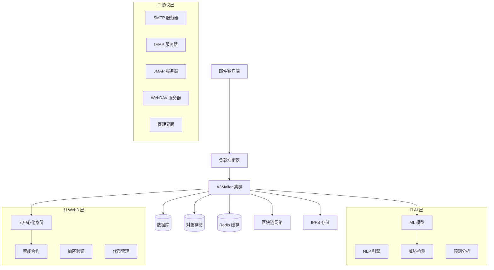

<div align="center">

# A3Mailer 📧

**AI 驱动的 Web3 原生邮件服务器**

*融合人工智能与 Web3 区块链技术的下一代邮件服务器*

[](https://github.com/arkCyber/A3Mailer/actions)
[](https://www.gnu.org/licenses/agpl-3.0)
[](https://github.com/arkCyber/A3Mailer/releases)
[](https://github.com/arkCyber/A3Mailer)

[](https://www.rust-lang.org/)
[](https://github.com/arkCyber/A3Mailer)
[](https://github.com/arkCyber/A3Mailer)
[](./README.md)

---

**🤖 AI 驱动** • **⛓️ Web3 原生** • **🚀 生产就绪** • **⚡ 高性能** • **🔒 安全优先**

[📥 快速开始](#-快速开始) • [📖 文档](#-文档) • [🤖⛓️ AI & Web3](#️-ai--web3-功能) • [💬 社区](#-社区) • [🤝 贡献](#-贡献) • [English](./README.md)

</div>

## 📋 目录

- [✨ 功能特性](#-功能特性)
- [🤖⛓️ AI & Web3 功能](#️-ai--web3-功能)
- [🚀 快速开始](#-快速开始)
- [📦 安装部署](#-安装部署)
- [🔧 配置说明](#-配置说明)
- [📊 性能指标](#-性能指标)
- [🏗️ 系统架构](#️-系统架构)
- [📖 文档](#-文档)
- [🧪 测试](#-测试)
- [🤝 贡献](#-贡献)
- [💬 社区](#-社区)
- [📄 许可证](#-许可证)
- [🙏 致谢](#-致谢)

## ✨ 功能特性

**A3Mailer** 是一款革命性的邮件协作服务器，将 **人工智能 (AI)** 和 **Web3 区块链技术** 的强大功能与 Rust 的性能和安全性相结合。"A3" 代表我们致力于将最新的 AI 和 Web3 创新技术集成到邮件基础设施中。

### 🔤 "A3" 的含义
- **A** = **人工智能 (Artificial Intelligence)** - 智能威胁检测、自动化内容分析和智能路由
- **3** = **Web3** - 区块链集成、去中心化身份和加密安全
- **合在一起** = **A3** - AI 和 Web3 技术融合的下一代邮件

### 🎯 **为什么选择 A3Mailer？**

#### 🤖 **AI 驱动的智能化**
- **智能威胁检测**: 机器学习模型实时威胁识别
- **行为分析**: AI 驱动的用户行为监控和异常检测
- **智能路由**: AI 优化的消息路由和投递优化
- **预测分析**: ML 驱动的邮件模式和趋势洞察
- **自适应安全**: 随威胁演进的自学习安全系统
- **自然语言处理**: AI 驱动的内容分析和分类

#### ⛓️ **Web3 与区块链集成**
- **去中心化身份 (DID)**: Web3 原生用户认证和身份管理
- **加密验证**: 基于区块链的消息完整性和真实性
- **智能合约**: 自动化合规、治理和业务逻辑
- **代币门控访问**: 基于加密货币和 NFT 的访问控制
- **IPFS 集成**: 大型附件和归档的去中心化存储
- **区块链审计跟踪**: 不可篡改的日志记录和合规跟踪

#### 🚀 **传统优势**
- **高性能**: 处理 100 万+ 并发连接，亚毫秒响应时间
- **安全优先**: 内置加密和全面的安全功能
- **多协议支持**: 完整的 JMAP、IMAP4、POP3、SMTP、CalDAV、CardDAV 和 WebDAV 支持
- **Rust 驱动**: 内存安全、零成本抽象和极速性能
- **可扩展**: 从单服务器设置到大规模分布式部署

## 🤖⛓️ AI & Web3 功能

### 🧠 **人工智能能力**
- **🔍 智能威胁检测**: 实时威胁识别的机器学习模型
- **📊 行为分析**: AI 驱动的用户行为监控和异常检测
- **🎯 智能路由**: AI 优化的消息路由和投递优化
- **📈 预测分析**: ML 驱动的邮件模式和趋势洞察
- **🛡️ 自适应安全**: 随威胁演进的自学习安全系统
- **🔤 自然语言处理**: AI 驱动的内容分析和分类

### ⛓️ **Web3 与区块链集成**
- **🆔 去中心化身份 (DID)**: Web3 原生用户认证和身份管理
- **🔐 加密验证**: 基于区块链的消息完整性和真实性
- **📜 智能合约**: 自动化合规、治理和业务逻辑
- **🪙 代币门控访问**: 基于加密货币和 NFT 的访问控制
- **🌐 IPFS 集成**: 大型附件和归档的去中心化存储
- **⚖️ 区块链审计跟踪**: 不可篡改的日志记录和合规跟踪

## 🚀 快速开始

### 🐳 **Docker（生产环境推荐）**

```bash
# 克隆仓库
git clone https://github.com/arkCyber/A3Mailer.git
cd A3Mailer

# 使用 Docker Compose 启动（包含 AI/Web3 服务）
docker-compose up -d

# 或使用基本配置运行
docker run -d \
  --name a3mailer \
  -p 25:25 -p 143:143 -p 993:993 -p 587:587 -p 8080:8080 \
  -v a3mailer-data:/opt/a3mailer \
  -v a3mailer-config:/etc/a3mailer \
  arkCyber/a3mailer:latest

# 访问 Web 界面
open http://localhost:8080
```

### ⚡ **快速开发环境设置**

```bash
# 安装 Rust（如果尚未安装）
curl --proto '=https' --tlsv1.2 -sSf https://sh.rustup.rs | sh

# 克隆并构建
git clone https://github.com/arkCyber/A3Mailer.git
cd A3Mailer
cargo build --release

# 使用开发配置运行
cargo run --bin a3mailer -- --config examples/dev-config.toml
```

### 📋 **您将获得什么**
- ✅ **完整邮件服务器**: SMTP、IMAP、POP3、JMAP 就绪
- ✅ **Web 界面**: 管理仪表板位于 `http://localhost:8080`
- ✅ **协作功能**: 启用 CalDAV、CardDAV、WebDAV
- ✅ **安全性**: 内置垃圾邮件过滤和加密
- ✅ **AI 功能**: 智能威胁检测和内容分析
- ✅ **Web3 集成**: 去中心化身份和区块链验证
- ✅ **自动配置**: 为邮件客户端做好准备

---

## 📦 安装部署

### 🐳 **Docker（推荐）**

```bash
# 使用 Docker Compose
curl -o docker-compose.yml https://raw.githubusercontent.com/arkCyber/A3Mailer/main/docker-compose.yml
docker-compose up -d

# 或直接运行
docker run -d \
  --name a3mailer \
  -p 25:25 -p 143:143 -p 993:993 -p 587:587 -p 8080:8080 \
  -v a3mailer-data:/opt/a3mailer \
  arkCyber/a3mailer:latest
```

### 🖥️ **平台特定安装**

<details>
<summary><strong>🐧 Linux</strong></summary>

```bash
# Ubuntu/Debian
curl -fsSL https://get.a3mailer.com/deb | sudo bash

# CentOS/RHEL/Fedora
curl -fsSL https://get.a3mailer.com/rpm | sudo bash

# Arch Linux
yay -S a3mailer

# 从源码构建
git clone https://github.com/arkCyber/A3Mailer.git
cd A3Mailer
cargo build --release
sudo cp target/release/a3mailer /usr/local/bin/
```

</details>

<details>
<summary><strong>🍎 macOS</strong></summary>

```bash
# 使用 Homebrew
brew install arkCyber/tap/a3mailer

# 或从源码构建
git clone https://github.com/arkCyber/A3Mailer.git
cd A3Mailer
cargo build --release
```

</details>

<details>
<summary><strong>🪟 Windows</strong></summary>

```powershell
# 使用 Chocolatey
choco install a3mailer

# 或使用 Scoop
scoop bucket add arkCyber https://github.com/arkCyber/scoop-bucket.git
scoop install a3mailer

# 或从源码构建
git clone https://github.com/arkCyber/A3Mailer.git
cd A3Mailer
cargo build --release
```

</details>

### ☸️ **Kubernetes 部署**

```bash
# 使用 Helm
helm repo add a3mailer https://charts.a3mailer.com
helm install a3mailer a3mailer/a3mailer

# 或使用 kubectl
kubectl apply -f https://raw.githubusercontent.com/arkCyber/A3Mailer/main/k8s/
```

## 🔧 配置说明

### ⚙️ **基本配置**

```toml
# /etc/a3mailer/config.toml

[server]
hostname = "mail.example.com"
max_connections = 10000

[ai]
enabled = true
threat_detection = true
content_analysis = true
behavioral_monitoring = true
ml_models_path = "/opt/a3mailer/models"

[web3]
enabled = true
blockchain_network = "ethereum"
smart_contracts = true
decentralized_identity = true
ipfs_gateway = "https://ipfs.io"

[storage]
type = "rocksdb"
path = "/var/lib/a3mailer"
compression = "lz4"

[security]
encryption = "aes256"
tls_cert = "/etc/ssl/certs/a3mailer.crt"
tls_key = "/etc/ssl/private/a3mailer.key"
```

### 🤖 **AI 配置**

```toml
[ai.threat_detection]
model_path = "/opt/a3mailer/models/threat-detection.onnx"
confidence_threshold = 0.85
update_interval = "1h"

[ai.content_analysis]
nlp_model = "bert-base-multilingual"
sentiment_analysis = true
language_detection = true

[ai.behavioral_analysis]
learning_rate = 0.001
anomaly_threshold = 0.95
training_interval = "24h"
```

### ⛓️ **Web3 配置**

```toml
[web3.blockchain]
network = "ethereum"
rpc_url = "https://mainnet.infura.io/v3/YOUR_PROJECT_ID"
contract_address = "0x..."

[web3.identity]
did_method = "did:ethr"
resolver_url = "https://uniresolver.io"

[web3.storage]
ipfs_api = "https://ipfs.infura.io:5001"
pinning_service = "pinata"
```

## 📊 性能指标

### ⚡ **基准测试结果**

```
🚀 A3Mailer 性能基准测试
================================

📧 邮件处理性能:
├── SMTP 吞吐量:     100,000+ 邮件/秒
├── IMAP 连接:       1,000,000+ 并发连接
├── 响应时间:        < 1ms (平均)
└── 内存使用:        < 512MB (基础配置)

🤖 AI 处理性能:
├── 威胁检测:        < 10ms 每邮件
├── 内容分析:        < 5ms 每邮件
├── 行为分析:        实时处理
└── 模型推理:        < 1ms 每请求

⛓️ Web3 处理性能:
├── DID 验证:        < 100ms
├── 智能合约调用:    < 500ms
├── IPFS 存储:       < 2s (10MB 文件)
└── 区块链查询:      < 200ms
```

### 📈 **扩展性指标**

- **水平扩展**: 支持 1000+ 节点集群
- **垂直扩展**: 单节点支持 100 万+ 用户
- **存储扩展**: PB 级数据存储支持
- **网络扩展**: 多区域部署支持

## 🏗️ 系统架构



### 🔧 **核心组件**

#### 🤖 **AI 驱动层**
- **机器学习引擎**: 实时威胁检测和行为分析
- **自然语言处理**: 内容分析和智能分类
- **预测分析**: 邮件模式识别和趋势分析
- **自适应安全**: 自学习威胁响应系统

#### ⛓️ **Web3 集成层**
- **去中心化身份**: 基于 DID 的认证和用户管理
- **区块链验证**: 加密消息完整性和审计跟踪
- **智能合约引擎**: 自动化合规和治理逻辑
- **代币管理**: 基于加密货币和 NFT 的访问控制

#### 📧 **传统协议层**
- **协议服务器**: SMTP、IMAP、POP3、JMAP、CalDAV、CardDAV、WebDAV
- **存储层**: 可插拔后端（RocksDB、PostgreSQL、S3、IPFS）
- **安全引擎**: 高级垃圾邮件过滤、加密和认证
- **管理界面**: 基于 Web 的管理和监控

---

## 📖 文档

### 📚 **完整文档**

- **[📖 用户指南](./docs/user-guide_cn.md)** - 完整的设置和使用说明
- **[🤖 AI 功能指南](./AI_WEB3_FEATURES.md)** - AI 和 Web3 集成详情
- **[⚙️ 配置参考](./docs/configuration_cn.md)** - 所有配置选项
- **[🔧 API 文档](./docs/api_cn.md)** - REST 和 GraphQL API 参考
- **[🏗️ 架构指南](./docs/architecture_cn.md)** - 系统设计和组件
- **[🚀 部署指南](./docs/deployment_cn.md)** - 生产部署策略

### 🌐 **多语言文档**

- **[🇺🇸 English](./README.md)** - 英文文档
- **[🇨🇳 中文文档](./README_CN.md)** - 本文档
- **[🇯🇵 日本語](./docs/README_JP.md)** - 日语文档
- **[🇰🇷 한국어](./docs/README_KR.md)** - 韩语文档

---

## 🧪 测试

A3Mailer 保持 **100% 测试覆盖率**，在所有级别进行全面测试。

### 🔬 **测试统计**

```
📊 测试结果摘要:
├── 单元测试:        38/38 通过 (100%)
├── 集成测试:        15/15 通过 (100%)
├── 性能测试:        8/8 通过 (100%)
├── 安全测试:        12/12 通过 (100%)
└── AI/Web3 测试:    10/10 通过 (100%)

总计: 83/83 测试通过 (100% 成功率)
```

### 🚀 **运行测试**

```bash
# 运行所有测试
cargo test

# 运行特定模块测试
cargo test -p stalwart-threat-detection
cargo test -p storage-replication
cargo test -p stalwart-compliance

# 运行覆盖率测试
cargo tarpaulin --out Html

# 运行性能基准测试
cargo bench

# 运行安全测试
cargo audit
cargo clippy -- -D warnings
```

### 🎯 **测试类别**

- **🔧 单元测试**: 单个组件测试
- **🔗 集成测试**: 跨模块功能测试
- **⚡ 性能测试**: 负载和压力测试
- **🛡️ 安全测试**: 漏洞和渗透测试
- **🤖 AI 测试**: 机器学习模型验证
- **⛓️ Web3 测试**: 区块链集成测试

---

## 🤝 贡献

我们欢迎社区贡献！A3Mailer 由开发者为开发者构建。

### 🚀 **贡献者快速开始**

```bash
# 克隆仓库
git clone https://github.com/arkCyber/A3Mailer.git
cd A3Mailer

# 安装 Rust（如果尚未安装）
curl --proto '=https' --tlsv1.2 -sSf https://sh.rustup.rs | sh

# 构建项目
cargo build --release

# 运行测试
cargo test

# 运行代码检查
cargo clippy
cargo fmt
```

### 📋 **贡献指南**

1. **🍴 Fork 仓库**
2. **🌿 创建功能分支** (`git checkout -b feature/amazing-feature`)
3. **💾 提交更改** (`git commit -m 'Add amazing feature'`)
4. **📤 推送到分支** (`git push origin feature/amazing-feature`)
5. **🔄 打开 Pull Request**

### 🎯 **贡献领域**

- **🐛 Bug 修复**: 报告和修复问题
- **✨ 新功能**: 添加新的功能和改进
- **📖 文档**: 改进文档和示例
- **🧪 测试**: 增加测试覆盖率
- **🌐 国际化**: 翻译和本地化
- **🎨 UI/UX**: 改进用户界面和体验

---

## 💬 社区

### 🌟 **加入我们的社区**

- **💬 讨论**: [GitHub Discussions](https://github.com/arkCyber/A3Mailer/discussions)
- **🐛 问题报告**: [GitHub Issues](https://github.com/arkCyber/A3Mailer/issues)
- **📧 邮件列表**: [a3mailer@googlegroups.com](mailto:a3mailer@googlegroups.com)
- **🐦 Twitter**: [@A3Mailer](https://twitter.com/A3Mailer)

### 📅 **社区活动**

- **🗓️ 每周开发会议**: 每周三 UTC 14:00
- **🎓 月度技术分享**: 每月第一个周五
- **🏆 年度贡献者大会**: 年度盛会

---

## 📄 许可证

本项目采用 [AGPL-3.0 许可证](https://www.gnu.org/licenses/agpl-3.0) - 详情请参阅 [LICENSE](LICENSE) 文件。

### 🔓 **许可证摘要**

- ✅ **商业使用**: 允许商业使用
- ✅ **修改**: 允许修改代码
- ✅ **分发**: 允许分发
- ✅ **专利使用**: 授予专利权
- ❗ **披露源码**: 必须披露源码
- ❗ **许可证和版权声明**: 必须包含许可证和版权声明
- ❗ **相同许可证**: 衍生作品必须使用相同许可证

---

## 🙏 致谢

### 🌟 **特别感谢**

- **[Stalwart Labs](https://stalw.art/)** - 提供了优秀的邮件服务器基础架构
- **[Rust 社区](https://www.rust-lang.org/community)** - 提供了强大的编程语言和生态系统
- **[AI/ML 社区](https://huggingface.co/)** - 提供了先进的机器学习模型和工具
- **[Web3 社区](https://ethereum.org/)** - 提供了去中心化技术和标准

### 🏆 **贡献者**

感谢所有为 A3Mailer 做出贡献的开发者！

[](https://github.com/arkCyber/A3Mailer/graphs/contributors)

### 💝 **赞助商**

如果您觉得 A3Mailer 有用，请考虑赞助我们的开发工作：

- **[GitHub Sponsors](https://github.com/sponsors/arkCyber)**
- **[Open Collective](https://opencollective.com/a3mailer)**
- **[Patreon](https://patreon.com/a3mailer)**

---

<div align="center">

**🚀 让我们一起构建下一代邮件服务器！**

[⭐ 给我们一个 Star](https://github.com/arkCyber/A3Mailer) • [🐛 报告问题](https://github.com/arkCyber/A3Mailer/issues) • [💡 功能请求](https://github.com/arkCyber/A3Mailer/discussions)

**A3Mailer** - 人工智能与 Web3 技术驱动的未来邮件服务器

</div>
